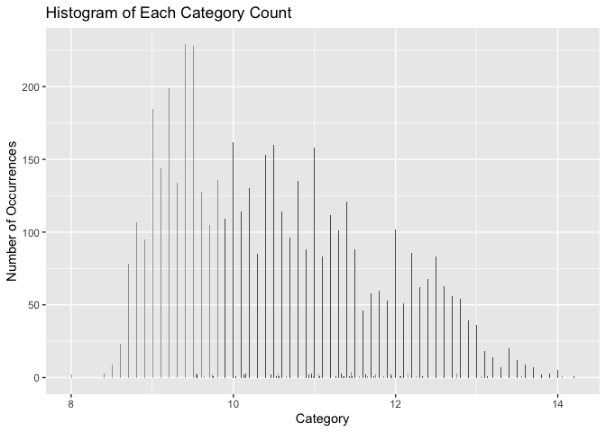

<!-- README.md is generated from README.Rmd. Please edit that file -->

# wineclassify

<!-- badges: start -->


[](https://codecov.io/gh/DSCI-310/dsci-310-group-02-pkg)

The goal of the wineclassify package aims to use R to help others
classify the different types of quality of wine based on a numerous
amount of variables. The package also includes functions such as
corr_plot, hist_plot and other functions that allows the user to
visualize and analyze the given data set. The package is similar to the
tidyverse package as this package also uses ggplot2, tidymodels,
recipes, workflows and etc. The wineclassify only targets the necessary
packages used in tidyverse thus making it simplier and more
straightforward to use. <!-- badges: end -->

The goal of `wineclassify` package is to help the users conduct a KNN
classification project from the start. It includes the functions to load
the dataset, visualize the data with histogram and correlation matrix,
build the KNN model and plot the confusion matrix to evaluate the
performance of the model.

## Installation

You can install the development version of `wineclassify` from
[GitHub](https://github.com/) with:

``` r
# install.packages("devtools")
devtools::install_github("DSCI-310/dsci-310-group-02-pkg")
#> Downloading GitHub repo DSCI-310/dsci-310-group-02-pkg@HEAD
#> 
#> ── R CMD build ─────────────────────────────────────────────────────────────────
#> * checking for file ‘/private/var/folders/cw/4ltklxm10r57c9rl1zj3nsbw0000gn/T/Rtmpx21hmG/remotesd0e02462bd4d/DSCI-310-dsci-310-group-02-pkg-e6c5aa3/DESCRIPTION’ ... OK
#> * preparing ‘wineclassify’:
#> * checking DESCRIPTION meta-information ... OK
#> * checking for LF line-endings in source and make files and shell scripts
#> * checking for empty or unneeded directories
#> * building ‘wineclassify_0.0.0.9000.tar.gz’
#> Installing package into '/private/var/folders/cw/4ltklxm10r57c9rl1zj3nsbw0000gn/T/RtmpI67gg2/temp_libpatha1d964de6b'
#> (as 'lib' is unspecified)
```

## Functions

- `data_load()`
- `hist_plot()`
- `corr_plot()`
- `model_build()`
- `model_results()`

## Usage

### data_load()

``` r
library(wineclassify)
#> Registered S3 method overwritten by 'GGally':
#>   method from   
#>   +.gg   ggplot2
## basic example code
d <- data_load("https://raw.githubusercontent.com/kashish1928/white_wine_dataset/main/winequality-white.csv", ";")
#> Rows: 4898 Columns: 12
#> ── Column specification ────────────────────────────────────────────────────────
#> Delimiter: ";"
#> dbl (12): fixed acidity, volatile acidity, citric acid, residual sugar, chlo...
#> 
#> ℹ Use `spec()` to retrieve the full column specification for this data.
#> ℹ Specify the column types or set `show_col_types = FALSE` to quiet this message.
d
#> # A tibble: 4,898 × 12
#>    `fixed acidity` `volatile acidity` `citric acid` `residual sugar` chlorides
#>              <dbl>              <dbl>         <dbl>            <dbl>     <dbl>
#>  1             7                 0.27          0.36             20.7     0.045
#>  2             6.3               0.3           0.34              1.6     0.049
#>  3             8.1               0.28          0.4               6.9     0.05 
#>  4             7.2               0.23          0.32              8.5     0.058
#>  5             7.2               0.23          0.32              8.5     0.058
#>  6             8.1               0.28          0.4               6.9     0.05 
#>  7             6.2               0.32          0.16              7       0.045
#>  8             7                 0.27          0.36             20.7     0.045
#>  9             6.3               0.3           0.34              1.6     0.049
#> 10             8.1               0.22          0.43              1.5     0.044
#> # ℹ 4,888 more rows
#> # ℹ 7 more variables: `free sulfur dioxide` <dbl>,
#> #   `total sulfur dioxide` <dbl>, density <dbl>, pH <dbl>, sulphates <dbl>,
#> #   alcohol <dbl>, quality <dbl>
```

### hist_plot()

``` r
library(wineclassify)
hist_plot(d, "quality")
```



### corr_plot()

``` r
library(wineclassify)
## basic example code
corr_plot(mtcars)
```


### model_build()

``` r
library(wineclassify)
model_build(iris, recipes::recipe(Species ~., data = iris), "Species")
#> ══ Workflow [trained] ══════════════════════════════════════════════════════════
#> Preprocessor: Recipe
#> Model: nearest_neighbor()
#> 
#> ── Preprocessor ────────────────────────────────────────────────────────────────
#> 0 Recipe Steps
#> 
#> ── Model ───────────────────────────────────────────────────────────────────────
#> 
#> Call:
#> kknn::train.kknn(formula = ..y ~ ., data = data, ks = min_rows(13L,     data, 5), kernel = ~"rectangular")
#> 
#> Type of response variable: nominal
#> Minimal misclassification: 0.03333333
#> Best kernel: rectangular
#> Best k: 13
```

### model_results()

``` r
library(wineclassify)
split <- rsample::initial_split(iris, prop = 0.75, strata = Species)
ex_test <- rsample::testing(split)
ex_train <- rsample::training(split)
ex_recipe <- recipes::recipe(Species ~., data = ex_train)
ex_model <- model_build(ex_train, ex_recipe, "Species")
model_results(ex_test, ex_model, "Species")
#>             Truth
#> Prediction   setosa versicolor virginica
#>   setosa         13          0         0
#>   versicolor      0         12         0
#>   virginica       0          1        13
```

For the detailed information about how to use the `wineclassify`
function, please refer to the [Vignette
Docs](https://github.com/DSCI-310/dsci-310-group-02-pkg/blob/main/vignettes/wineclassify.Rmd)

## Contributing

We welcome and appreciate the contributions to the `wineclassify`
function. Please read
[here](https://github.com/DSCI-310/dsci-310-group-02-pkg/blob/main/CONTRIBUTION.md)
on how to contribute to the package.

## License

This package uses MIT open source license.
