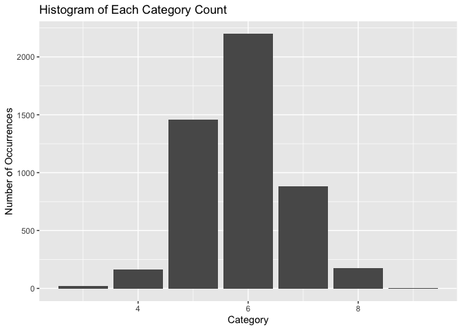

<!-- README.md is generated from README.Rmd. Please edit that file -->

# WINECLASSIFY

<!-- badges: start -->


[](https://codecov.io/gh/DSCI-310/dsci-310-group-02-pkg)

The goal of the wineclassify package aims to use R to help others
classify the different types of quality of wine based on a numerous
amount of variables. The package also includes functions such as
corr_plot, hist_plot and other functions that allows the user to
visualize and analyze the given data set. The package is similar to the
tidyverse package as this package also uses ggplot2, tidymodels,
recipes, workflows and etc. The wineclassify only targets the necessary
packages used in tidyverse thus making it simplier and more
straightforward to use. <!-- badges: end -->

# Installation

``` r
#install.packages("devtools")
devtools::install_github("DSCI-310/dsci-310-group-02-pkg")
#> Skipping install of 'wineclassify' from a github remote, the SHA1 (5397c9a5) has not changed since last install.
#>   Use `force = TRUE` to force installation
```

# Functions

The function data_load() takes in the URL of the dataset as the first
paramter and the seperator as the second parameter

``` r
library(wineclassify)
#> Registered S3 method overwritten by 'GGally':
#>   method from   
#>   +.gg   ggplot2
## basic example code
d <- data_load("https://raw.githubusercontent.com/kashish1928/white_wine_dataset/main/winequality-white.csv",";")
#> Rows: 4898 Columns: 12
#> ── Column specification ────────────────────────────────────────────────────────
#> Delimiter: ";"
#> dbl (12): fixed acidity, volatile acidity, citric acid, residual sugar, chlo...
#> 
#> ℹ Use `spec()` to retrieve the full column specification for this data.
#> ℹ Specify the column types or set `show_col_types = FALSE` to quiet this message.
d
#> # A tibble: 4,898 × 12
#>    `fixed acidity` `volatile acidity` `citric acid` `residual sugar` chlorides
#>              <dbl>              <dbl>         <dbl>            <dbl>     <dbl>
#>  1             7                 0.27          0.36             20.7     0.045
#>  2             6.3               0.3           0.34              1.6     0.049
#>  3             8.1               0.28          0.4               6.9     0.05 
#>  4             7.2               0.23          0.32              8.5     0.058
#>  5             7.2               0.23          0.32              8.5     0.058
#>  6             8.1               0.28          0.4               6.9     0.05 
#>  7             6.2               0.32          0.16              7       0.045
#>  8             7                 0.27          0.36             20.7     0.045
#>  9             6.3               0.3           0.34              1.6     0.049
#> 10             8.1               0.22          0.43              1.5     0.044
#> # ℹ 4,888 more rows
#> # ℹ 7 more variables: `free sulfur dioxide` <dbl>,
#> #   `total sulfur dioxide` <dbl>, density <dbl>, pH <dbl>, sulphates <dbl>,
#> #   alcohol <dbl>, quality <dbl>
```

The function hist_plot() plots a histogram given the data and the
category that the visualization would like to be based on

``` r
library(wineclassify)

hist_plot(d, "alcohol")
#> Warning: The following aesthetics were dropped during statistical transformation: fill
#> ℹ This can happen when ggplot fails to infer the correct grouping structure in
#>   the data.
#> ℹ Did you forget to specify a `group` aesthetic or to convert a numerical
#>   variable into a factor?
```



The function corr_plot shows a correlation plot between all the given
variables for the model

``` r
library(wineclassify)
corr_plot(d)
```


